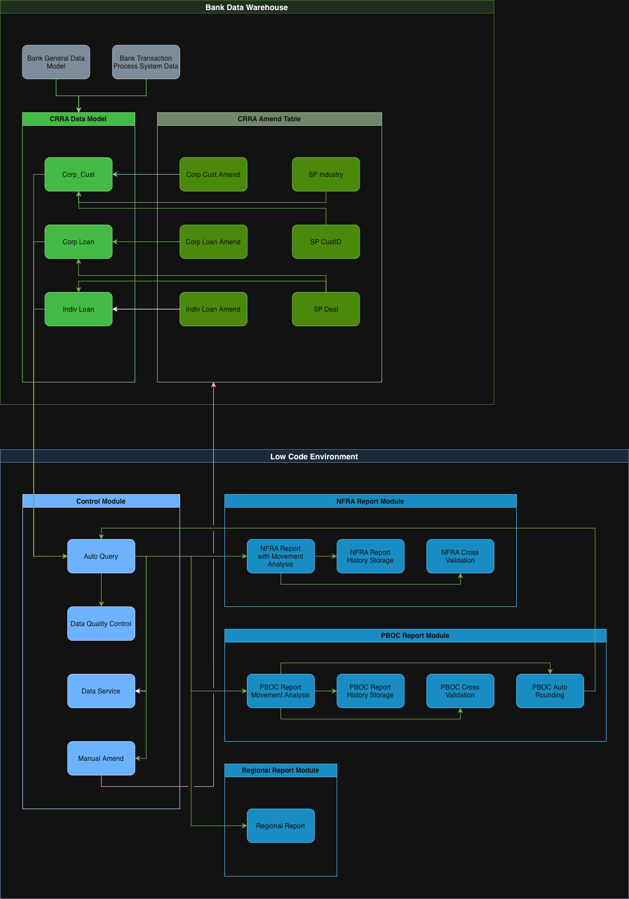

# System Architecture & Design Decisions

This document covers the technical architecture of a regulatory reporting automation suite built for the Finance department of a top-tier international bank in China. The system processes 900+ reports across NFRA and PBOC frameworks, covering 20+ branch entities.

This is not a documentation of what was built. It is a record of why it was built this way.

---

## Contents

- [1. Previous Version](#1-previous-version)
- [2. CRRA Data Model](#2-crra-data-model)
- [3. CRRA Automation Suite](#3-crra-automation-suite)
- [4. CRRA Data Flow](#4-crra-data-flow)
- [5. Achievement & Impact](#5-achievement--impact)
- [6. Q&A](#6-qa)

---

## 1. Previous Version

The 1.0 system was not a system. It was an accumulation.

Over time, customer data, transaction data, and regulatory logic had collapsed into the same tables. What started as pragmatic shortcuts had hardened into structural constraints. By the time the 1.0 system was handed over, three fundamental flaws had become load-bearing:

**No separation of concerns.** Business data and regulatory logic were entangled. A change in one place broke things in three others. Isolating the impact of any modification was effectively impossible.

**No elasticity.** Field designs were rigid and IT-owned. Every regulatory update — and regulators update frequently — required code rewrites, formal change requests, and weeks of lead time. The system could not keep pace with the rules it existed to serve.

**No auditability.** Calculations happened inside black boxes. When output numbers were wrong, the only diagnostic tool was calling the person who built it. When that person was unavailable, or had left, there was no fallback.

These were not implementation problems that better execution would have fixed. They were architecture problems. Fixing the implementation would have bought months. Redesigning the architecture bought years.

---

## 2. CRRA Data Model

The core of the system is a two-layer data model that strictly separates what the data is from what the regulations require it to mean.

### Data Sources

Two upstream systems feed the model:

**Bank General Data Model** — The bank's central data warehouse (EDMP). The primary source of truth for all customer and loan records. All automated data flows originate here.

**Bank Transaction Process System Data** — A supplementary source covering fields and dimensions absent from the bank's standard data model. Where the General Data Model stops short of regulatory requirements, this source fills the gap.

Having two distinct upstream sources was a constraint, not a design choice. The architecture's response was to consolidate both into a single ingestion entry point, so every downstream component works from the same unified view regardless of source.

### Layer 1: Core Tables (本表)

Three tables form the source of truth:

**Corp Cust** — One record per legal entity. Unique PK. Covers industry classification, enterprise scale, unified credit code, geography, country, and credit limits. Extensible via computed fields for special industry flags without touching the base structure.

**Corp Loan** — Transaction-level granularity. One record per loan note, linked to Corp Cust via PK in a star schema. Covers institution, currency, principal, balance, interest rate, overdue metrics, five-tier classification, collateral type, and beneficiary.

**Indiv Loan** — By design, no separate individual customer table exists. PII data for individual clients is collapsed into the transaction table itself, eliminating the attack surface for data leakage at the architectural level.

### Layer 2: CRRA Amend Table (调整表)

Six tables handle everything that deviates from the norm:

Three mirror adjustment tables — Structurally identical to their corresponding core tables, field for field. When upstream data has errors or regulatory logic requires overrides, business users write directly to these tables. No IT involvement, no code changes, no waiting.

Three special rule mapping tables:

∙ **SP Industry** — Maps industry codes to regulatory classifications that change frequently (digital economy, agricultural loans, etc.). Regulatory policy changes never touch the core tables.

∙ **SP CustID** — Handles edge cases for specific entity types with non-standard reporting requirements. Designed to self-retire as upstream data quality improves.

∙ **SP Deal** — Isolates legacy system anomalies and non-standard product lines that cannot be classified through normal logic. Keeps the main pipeline clean.

---

## 3. CRRA Automation Suite

Built on Dataiku — the first production deployment of the platform within Standard Chartered China, and the foundation of what became the bank's low-code ecosystem.

50+ pipeline components, organised into two modules:

### Control Module

**Auto Query** — The sole interface between the system and the upstream data sources. All data from both the Bank General Data Model and the Bank Transaction Process System flows through a single entry point, ensuring every downstream component works from the same unified source. One trigger initiates the entire downstream sequence automatically.

**Data Quality Control** — Triggered automatically on every data pull, bound directly to Auto Query. No manual initiation required. Anomalies surface before any report generation begins — not after. General Ledger reconciliation is performed here: financial totals from the data model are reconciled against the GL before any report generation, catching discrepancies at the source rather than during regulatory review.

**Data Service** — Manages the distribution of processed data to the downstream report modules. Acts as the controlled handoff point between the control layer and the reporting engine, ensuring each module receives a consistent, validated data set.

**Manual Amend** — The system's single point of human intervention. Analyses gaps in upstream data that cannot be resolved through automated logic, and surfaces them for operator review.

### Regulatory Reporting Engine

**NFRA Report Module** — Core report generation across all 1104 framework templates, with movement analysis against prior periods built in. Output feeds directly into History Storage for audit and reuse, and into Cross Validation for inter-report consistency checks.

**PBOC Report Module** — Core report generation with movement analysis, History Storage, and Cross Validation mirroring the NFRA structure. Two additional components specific to PBOC requirements: metadata export for submission formatting, and Auto Rounding — automated rounding and zero-suppression adjustments mandated by PBOC. Auto Rounding feeds back into Auto Query: because rounding adjustments can affect upstream aggregation logic, the loop is intentional and necessary for numerical consistency across the full report set.

**Regional Report Module** — Localised report generation for branch-specific regulatory requirements across 20+ entities. Same architecture, jurisdiction-specific logic.

All pipelines are chained via Dataiku Scenarios. One trigger initiates the entire sequence — ingestion, quality checks, calculations, validation, and output — without human coordination at any step.

---

## 4. CRRA Data Flow

Every data flow in this system is automated — with one deliberate exception.

### Automated Flow (green)

Auto Query pulls from both upstream sources on a scheduled trigger, consolidating all data into a single unified input. Data Quality Control fires immediately and automatically — GL reconciliation runs here, and any anomalies are flagged before any report generation begins. Data Service then distributes the validated data set to the three reporting modules in parallel: NFRA, PBOC, and Regional. Each module runs its report generation, movement analysis, cross-validation, and history storage as a chained sequence, with no human coordination required at any step. The one exception within the automated flow is PBOC Auto Rounding, which loops back to Auto Query — rounding adjustments can affect upstream aggregation, so the feedback loop is necessary to maintain numerical consistency across the full report set.

### Manual Flow (red)

When Data Quality Control surfaces anomalies that require human judgment, the operator follows a four-step loop: review the quality report to identify what needs correcting; run Manual Amend to check and prepare the required amendments; upload the amendment file to the data warehouse to refresh the core tables; re-run Data Quality Control to confirm the issues are resolved. The loop repeats until the quality report is clean.

This is the only point in the system where a person touches data directly. It was not an oversight. It was a containment decision: you cannot fully automate judgment, but you can restrict human intervention to a single, well-defined, auditable entry point — and design everything else to never need it.

---

## 5. Achievement & Impact

| Metric | Result |
|---|---|
| Delivery timeline | 3 months |
| Monthly FTE saved | 3+ |
| Report delivery acceleration | 48 hours |
| System complexity reduction | 40% |
| Data consistency | 100% via automated validation |
| Organisational impact | Adopted as bank-wide standard architecture |

Beyond the metrics, three things stand out:

**The system outlived its creator.** The architecture was designed so business users could own and maintain it independently. When the project lead left, there was zero operational disruption.

**The system outlived its platform.** When Dataiku was discontinued for political reasons, the engineering team didn't revert to manual processes. They went looking for another tool to keep working the same way. Transparent, documented logic can be migrated. Black boxes cannot.

**The methodology outlived the system.** The architecture was adopted as the standard template for all future Finance regulatory reporting automation within the bank — extending beyond loans into a full cross-business framework. Operations teams began replicating the same automation patterns independently. A long-standing reconciliation failure between NFRA 1104 and EAST reports was resolved as a byproduct of shared data lineage.

---

## 6. Q&A

**Why not full normalisation?**

Early design considered extracting collateral information into separate tables and splitting non-core fields into extension tables. This was rejected — not out of laziness, but pragmatism. Full normalisation would have added months to delivery for marginal theoretical gain. The system needed to be in production before the reporting window closed. Deliberate denormalisation was the right call. It shipped on time.

**Why mirror tables instead of a purpose-built exception handling system?**

A purpose-built exception system would have been technically cleaner. It would also have required IT to build and maintain it, and business users to learn a new interface. Mirror tables are instantly understandable to anyone who knows the core tables. Business users can make batch corrections across multiple fields in a single operation. When upstream data fails at 11pm before a submission deadline, the mirror table is the difference between a crisis and a workaround.

**Why star schema for corporate loans?**

Customer attributes change infrequently. Loan transactions change constantly. Keeping them in separate tables with a clean PK relationship means customer updates propagate automatically without touching transaction records, and transaction queries don't carry the weight of customer data they don't need.

**Why collapse individual PII into the transaction table?**

An individual customer table would have been architecturally cleaner. It would also have created a centralised, queryable store of personal identity information — a liability that serves no operational purpose. The decision to denormalise PII into the transaction table was a deliberate risk reduction choice, not a shortcut.

**Why low-code instead of Python?**

Python was an option. It was rejected — not primarily because of skill level, but because of what Python-based systems look like to the people who inherit them. Even experienced developers struggle to read each other's code. Expecting Finance business users to maintain a Python pipeline is not a digital transformation strategy. It is a hostage situation. Low-code tools solve a different problem: every transformation step is visible, every logic change is traceable, the visual flow maps directly to how people already think about data. At Standard Chartered, Finance team members with no technical background learned to maintain parts of the system themselves. That is the difference between a system that outlives its creator and one that doesn't.

**Why Dataiku specifically?**

It wasn't a choice — it was a mandate. The original build was planned on Alteryx; a group-level policy shift required migration to Dataiku before development began in earnest. The migration happened in one month. The constraint turned into an advantage: the forced re-examination of every assumption produced a cleaner implementation than the original plan would have. This became the template for how other departments approached Dataiku adoption across Standard Chartered China.

---

[Philosophy: Sustainable Digitalisation](PHILOSOPHY.md)
