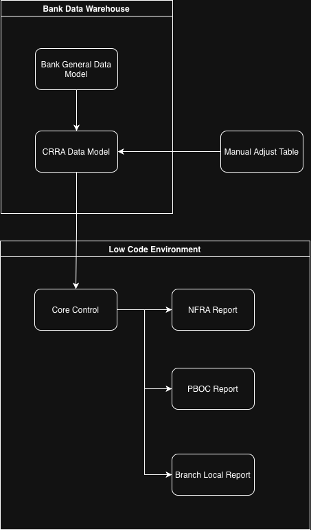

# China Regulatory Reporting Automation

End-to-end data pipeline architecture for financial regulatory compliance

---

## The Problem

Every major international bank operating in China faces the same regulatory data challenge: two regulators — NFRA and PBOC — with overlapping but inconsistent frameworks, hundreds of reports per submission cycle, and source data that was never designed with regulatory logic in mind.

The industry's default response has been to throw people at it. More headcount, more manual checks, more spreadsheet gymnastics. This works until it doesn't — and when it fails, it fails at 11pm before a submission deadline.

The deeper problem is structural. Most reporting systems in this space were never architected; they accumulated. Business data and regulatory logic live in the same tables. Validation is manual. Auditability is a fiction. Every change requires IT. Every error requires a person who knows where the bodies are buried.

When that person leaves, the system doesn't just slow down. It stops.

---

## The Solution

Independently architected and delivered a full automation suite from scratch — no dedicated engineering team, no external consultants, in three months.

The core of the system is a custom **3+6 data model** that strictly separates business data from regulatory logic — so a change in one never breaks the other. On top of it, **50+ automation pipelines** handle ingestion, quality control, GL reconciliation, report generation, variance analysis, and cross-report validation end-to-end.

The design was built for longevity, not just delivery. Business users were trained to own and maintain the system independently. The documentation was written for handover, not for record-keeping. When the project lead left, there was zero operational disruption.

The system outlived its creator. Then it outlived its platform. The methodology is still running.

**Built with:** `Dataiku` `SQL` `Python` `Alteryx` `Confluence`

→ [Architecture & Design Decisions](ARCHITECTURE.md)

---

## The Methodology

Delivery in three months wasn't the result of working faster. It was the result of thinking differently about what needed to exist at all.

The guiding principle — borrowed from aerospace, applied to banking — was to question every requirement before building anything, delete every process step that couldn't justify its existence, and automate only what remained. Most systems accumulate complexity because nobody asks whether the complexity was necessary in the first place.

The same principle drove the build-for-longevity decisions: low-code over Python, mirror tables over exception systems, deliberate denormalisation over theoretical purity. Every choice was evaluated against one question: can someone else maintain this without me?

→ [Philosophy: Sustainable Digitalisation](PHILOSOPHY.md)

---

## Outcomes

| Metric | Result |
|---|---|
| Delivery timeline | 3 months |
| Monthly FTE saved | 3+ |
| Report delivery acceleration | 48 hours |
| System complexity reduction | 40% |
| Data consistency | 100% via automated validation |
| Organisational impact | Adopted as bank-wide standard architecture |

The architecture was eventually adopted as the standard template for all future Finance regulatory reporting automation within the bank — extending beyond loans into a full cross-business framework. A long-standing reconciliation failure between NFRA 1104 and EAST reports was resolved as a byproduct of shared data lineage. When the low-code platform was discontinued, the engineering team didn't revert. They went looking for another tool to keep working the same way.

